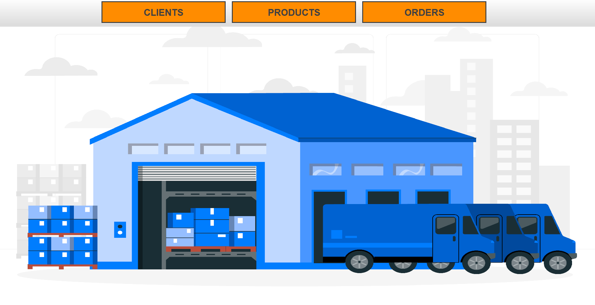

🛒 Orders Processing Application
Welcome to the Orders Processing Application repository! This is a robust, desktop-based management system designed to streamline the handling of clients, product inventories, and customer orders. It utilizes a relational database architecture to ensure data integrity and seamless business operations.

📖 Project Overview
This application serves as a complete backend and frontend solution for a basic e-commerce or retail management setup. It provides an intuitive graphical interface for administrators to execute CRUD (Create, Read, Update, Delete) operations on both clients and products.

Furthermore, the system includes intelligent order processing logic: when a customer places an order, the application verifies product availability, automatically updates stock levels in the database, and generates a bill—preventing over-ordering and keeping inventory synchronized.

✨ Key Features
👥 Client Management:

Add new clients, update existing information, view the complete client roster, or delete records from the database.

📦 Product & Inventory Management:

Manage product catalogs including names, prices, and available stock quantities.

🧾 Order Processing & Validation:

Create new orders by selecting a client and a product.

Smart Stock Check: The system automatically verifies if the requested quantity is available in stock.

Auto-Update: If the order is valid, the product's stock is automatically decremented in the database.

🗄️ Relational Database Integration:

Fully integrated with a MySQL database using JDBC, ensuring all data is persistently and securely stored.

📸 Screenshots
Here is a look at the application menu:

💻 Tech Stack & Architecture
Language: Java (Core SE)

User Interface: Java Swing / AWT

Database: MySQL

Connectivity: Java Database Connectivity (JDBC)

Architecture: The project follows a structured Data Access Object (DAO) or MVC pattern, separating the database logic from the user interface.

🚀 Getting Started
Prerequisites
Java Development Kit (JDK): Version 8 or higher.

MySQL Server: Installed and running on your local machine.

JDBC Driver: MySQL Connector/J (usually added via Maven or as an external .jar).

Database Setup
To run this application, you must first set up the local database:

Open your MySQL client (e.g., MySQL Workbench).

Execute the provided .sql script (look for a database_setup.sql or similar file in the repository) to create the schema and necessary tables (Client, Product, Order).

Update the database connection credentials (URL, Username, Password) in the project's source code (usually in a ConnectionFactory or DatabaseManager class) to match your local setup.

Running the Application
git clone https://github.com/Adelinn77/Orders-Processing-App.git

Open the project in your preferred IDE (IntelliJ IDEA, Eclipse, etc.).

Ensure the JDBC driver is correctly linked to your project structure or pom.xml.

Compile and run the main application class to launch the GUI!

Author: Adelinn77

A complete relational database and GUI integration project.
